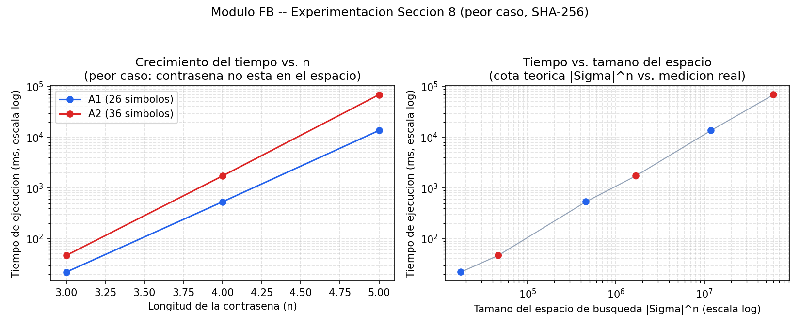
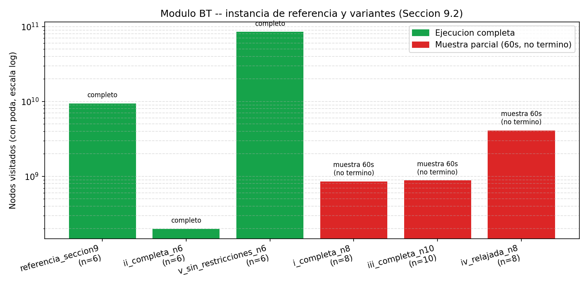

# Práctica 1 — Fuerza Bruta y Backtracking

**Curso:** Análisis y Diseño de Algoritmos
**Integrantes:** Javier Andrés Sierra Machado, Camila García Ortiz, Jerónimo Vélez Acosta
**Fecha:** 31 de agosto de 2026

> **Nota del equipo (borrador):** este documento es generado con
> asistencia de IA (Claude) a partir de resultados reales ya ejecutados
> (ver `results/` y `report/fb_pseudocodigo_complejidad.md` /
> `bt_pseudocodigo_complejidad.md`), a petición de Jerónimo Vélez Acosta y con su revisión.
> Las secciones 15 (Conclusiones) y 17 (Uso de IA) se completaron el
> 30-ago-2026, también con asistencia de IA y a petición explícita de
> Jerónimo

## 2. Introducción

Esta práctica compara dos estrategias de búsqueda exhaustiva para el
problema de recuperación de contraseñas: fuerza bruta pura (Módulo FB) y
backtracking con poda (Módulo BT). El objetivo no es solo implementar
ambos algoritmos, sino medir empíricamente su costo computacional,
contrastarlo contra la cota teórica, y entender en qué condiciones cada
técnica deja de ser viable. El documento sigue la estructura exigida por
la Sección 12 del enunciado: contexto, fundamentación teórica,
modelamiento, diseño, pseudocódigo, implementación, análisis de
complejidad, casos de prueba, experimentación, resultados y conclusiones.

## 3. Contexto del problema

Un analista de seguridad recibe un hash SHA-256 (Módulo FB) o una
política de composición de contraseñas (Módulo BT) y debe determinar,
respectivamente, la contraseña original o el conjunto de contraseñas
válidas — sin acceso a la contraseña en texto plano. En ambos casos el
espacio de búsqueda es finito pero potencialmente enorme (`|Σ|ⁿ`), lo que
hace del problema un caso de estudio directo para comparar enumeración
exhaustiva sin información (fuerza bruta) contra enumeración con poda
basada en restricciones estructurales (backtracking).

## 4. Fundamentación teórica

**Fuerza bruta:** procedimiento sistemático que genera cada elemento de
`Σⁿ` exactamente una vez (sin omisiones ni repeticiones) y lo evalúa
contra un criterio de aceptación. Es apropiada cuando el espacio es finito
y enumerable, no hay una propiedad estructural que permita descartar
candidatos sin evaluarlos, y el tamaño de instancia es tolerable. Su
costo temporal es `Θ(|Σ|ⁿ)`; su costo espacial es `Θ(n)` si se genera un
candidato a la vez (no se materializa el espacio completo).

**Backtracking:** búsqueda exhaustiva sobre un árbol de estados
parciales, donde las soluciones se construyen incrementalmente y una rama
se abandona ("se poda") en cuanto se determina que no puede llevar a una
solución válida. Backtracking sigue siendo, en el peor caso, una técnica
de exploración completa (mismas garantías de completitud que fuerza
bruta); su ventaja está en el **orden de exploración** y en usar
información parcial para evitar recorrer subárboles completos. Cuando esa
información parcial es débil (poca restricción relativa a `n`), la poda
degenera y el costo se acerca al de fuerza bruta pura — fenómeno que este
proyecto documenta empíricamente en la Sección 13.

## 5. Modelamiento

**Módulo FB:** espacio de búsqueda `Σⁿ`, con alfabetos A1 (a–z, 26
símbolos) y A2 (a–z + 0–9, 36 símbolos), longitudes n ∈ {3,4,5,6} para A1
y n ∈ {3,4,5} para A2. Criterio de aceptación: `SHA256(candidato) ==
hash_objetivo`.

**Módulo BT:** estado parcial = prefijo de longitud k (0 ≤ k ≤ n) +
contador de caracteres por categoría (minúscula, mayúscula, dígito,
símbolo). Estado inicial: cadena vacía. Estados terminales: prefijos de
longitud n; son solución si cumplen la política (mínimos por categoría,
sin repetidos consecutivos). Alfabeto base: minúsculas + mayúsculas +
dígitos + `!@#$%` = 26+26+10+5 = **67 símbolos** (el enunciado menciona
"69 símbolos"; se implementó literalmente el conjunto descrito — ver
ambigüedad pendiente de confirmar con el docente).

## 6. Diseño algorítmico

**FB** usa un "odómetro" en base `|Σ|`: el candidato es un arreglo de `n`
símbolos que se incrementa como un contador de base `m`, garantizando
cubrir las `mⁿ` combinaciones exactamente una vez, en orden lexicográfico
según el orden del alfabeto. El ataque por diccionario (Sección 8.1)
reemplaza esa enumeración por un recorrido lineal sobre una lista finita
de candidatos plausibles.

**BT** construye el prefijo carácter por carácter. En cada paso se aplican
dos podas: (1) poda local — no repetir el último carácter; (2) poda de
factibilidad — descartar la rama si, aun llenando todas las posiciones
restantes con los tipos de carácter que faltan, no alcanzaría los
mínimos exigidos. Es una condición **necesaria pero no suficiente**
(nunca descarta una rama que sí podría llevar a solución), por lo que la
poda de este proyecto actúa mayormente cerca del final del árbol, no de
forma distribuida — ver análisis en la Sección 13.

## 7. Pseudocódigo

Ver el pseudocódigo completo y comentado en
`report/fb_pseudocodigo_complejidad.md` (enumeración FB + ataque por
diccionario) y `report/bt_pseudocodigo_complejidad.md` (backtracking con
poda + versión sin poda). Resumen:

```
FUERZA_BRUTA(Σ, n, objetivo):           BACKTRACK_CON_PODA(politica, alfabeto, prefijo, conteo):
  candidato ← Σ[0]^n                      si |prefijo| = n:
  mientras verdadero:                        si cumple(conteo): registrar solucion
    si coincide(candidato, objetivo):        retornar
        retornar ENCONTRADA                para c en alfabeto:
    candidato ← siguiente(candidato, Σ)        si c = ultimo: continuar        (poda 1)
    si se desbordo: retornar NO_ENCONTRADA      si no es_factible(...): continuar (poda 2)
                                                 prefijo.push(c); recursion; prefijo.pop()
```

## 8. Implementación

Ambos módulos están en C++17. FB usa `picosha2.h` (biblioteca de cabecera
única, dominio público) para SHA-256 — no se implementó el algoritmo de
hash desde cero, según lo autoriza la Sección 10. BT usa una clase
`Estado` (algoritmo entregado por Camila García Ortiz, ver Sección 17)
para llevar el prefijo y el conteo incremental por categoría, evitando
recontar el prefijo completo en cada nodo. La estructura del repositorio
sigue exactamente la Sección 11 en `ada_p1/` (`src/`, `tests/`,
`resources/`, `results/`, `report/`), con `fb_*.cpp/hpp` y
`bt_*.cpp/hpp` separados y `src/main.cpp` como único punto de entrada.

**Detalle de QA:** la línea de compilación literal del enunciado (`g++
-std=c++17 -O2 -o ada_p1 src/main.cpp src/*.cpp`) falla con "multiple
definition of main", porque el glob `src/*.cpp` ya incluye a `main.cpp`.
La forma correcta es `g++ -std=c++17 -O2 -o ada_p1 src/*.cpp` (sin
repetir `src/main.cpp`).

## 9. Análisis de complejidad

| | Mejor caso | Peor caso | Caso promedio | Espacial |
|---|---|---|---|---|
| FB (fuerza bruta) | Θ(1) | Θ(mⁿ) | Θ(mⁿ) | Θ(n) |
| FB (diccionario) | Θ(1) | Θ(D) | Θ(D) | Θ(D) (lista cargada en memoria) |
| BT (con poda) | Θ(n) (caso ideal, poco frecuente aquí) | Θ(mⁿ) (política casi sin restricción) | depende del margen `Σmin` vs. `n` | Θ(n) |
| BT (sin poda) | Θ(mⁿ) | Θ(mⁿ) | Θ(mⁿ) | Θ(n) |

Donde `m = |Σ|`, `n` = longitud, `D` = tamaño del diccionario. El detalle
de cada demostración está en `report/fb_pseudocodigo_complejidad.md` y
`report/bt_pseudocodigo_complejidad.md`.

## 10. Casos de prueba

**FB — semilla del equipo:** 1811 (apellidos garcia, sierra, velez, orden
alfabético, un apellido por integrante). 5 instancias construidas con esa
semilla (`resources/fb_instancias_equipo_hashes.txt`), verificadas de
forma independiente con la herramienta de QA `tools/qa_reference/qa_fb`.
Instancia de referencia común: A2, n=5, candidata `abc12`.

**BT — semilla del equipo:** 1811 → política (n=8): `minLower=2
minUpper=2 minDigit=3 minSymbol=1` (minLower se ajustó de 4 a 2 porque
`Σmin=10 > n=8`, documentado en `PENDIENTES.md`). Instancia de referencia
común: n=6, alfabeto completo, `minLower=2 minUpper=1 minDigit=1
minSymbol=1`.

**Automatización:** `ada_p1/tests/test_ada_p1.sh` compila desde cero y
verifica automáticamente la instancia de demostración de FB, el cálculo
de semilla/política de BT, y que con poda / sin poda coincidan en número
de soluciones (Sección 8.2) — ver disclosure de IA en el propio script.

## 11. Experimentación

**FB (Sección 8):** 6 configuraciones, peor caso (contraseña fuera del
espacio), alfabetos A1/A2, n=3..5 — ver
`results/fb_experimentacion_seccion8.csv` y
`results/fb_experimentacion_seccion8.png`.

**BT (Sección 9.2):** instancia de referencia + 5 variantes de dificultad
(alfabeto completo, 67 símbolos) — ver
`results/bt_referencia_y_variantes.csv` y
`results/bt_referencia_y_variantes.png`.





## 12. Resultados

**FB — instancias del equipo** (semilla 1811,
`results/fb_instancias_equipo.csv`):

| id | alfabeto | n | contraseña | intentos | tiempo |
|---|---|---|---|---|---|
| 1 | A1 | 4 | axyh | 16 180 | 21.6 ms |
| 2 | A2 | 4 | 2zgx | 1 339 008 | 1.72 s |
| 3 | A1 | 5 | ubwnk | 9 172 317 | 11.9 s |
| 4 | A2 | 5 | b8dm7 | 3 270 274 | 4.17 s |
| 5 | A1 | 6 | ovkbsl | 176 112 676 | 3 min 34 s |

**BT — referencia y variantes** (`results/bt_referencia_y_variantes.csv`):

| Instancia | n | Nodos | Soluciones | Tiempo | Estado |
|---|---|---|---|---|---|
| Referencia común | 6 | 9 454 738 424 | 8 883 856 800 | 7 min 47 s | Completo |
| (ii) política completa | 6 | 199 470 612 | 180 629 800 | 12.6 s | Completo |
| (i) política completa | 8 | ≥856.7 M (muestra 60 s) | — | no termina | Ver Sección 13 |
| (iii) política completa | 10 | ≥881.9 M (muestra 60 s) | — | no termina | Ver Sección 13 |
| (iv) política relajada | 8 | ≥4.10 B (muestra 60 s) | — | no termina | Ver Sección 13 |
| (v) sin restricciones | 6 | 85 197 148 478 | 83 906 282 592 | 20 min 48 s | Completo |

## 13. Análisis de resultados

**FB:** el costo por intento se mantuvo entre 1.0 y 1.25 µs/intento en
todas las configuraciones probadas, sin importar `m` o `n` — confirma
empíricamente el modelo teórico `Θ(mⁿ)` con costo `Θ(1)` amortizado por
intento. Entre A1 n=3 (17 576 combinaciones, 22 ms) y A1 n=5 (11 881 376
combinaciones, ~13.6 s) la longitud creció en 2, pero el tiempo se
multiplicó ~620 veces: el "muro exponencial" (ver
`fb_pseudocodigo_complejidad.md`).

**BT:** la poda de este proyecto es una condición *necesaria*, no
*suficiente*, y actúa mayormente cerca del final del árbol. Esto explica
que la instancia de referencia (1 posición de margen) haya tardado casi 8
minutos para 6 símbolos de longitud, y que las variantes (i), (iii), (iv)
— con longitudes mayores o políticas más laxas — **no terminen en tiempo
razonable** con esta implementación: (iv), con casi ninguna restricción
de composición, visitó 4.1 mil millones de nodos en 60 segundos sin señal
de desacelerar. La variante (v) (sin restricciones, n=6) sí se corrió
hasta el final: 85 197 148 478 nodos, 83 906 282 592 soluciones en 20 min
48 s — este número de soluciones coincide **exactamente** con la cota
teórica `67 × 66⁵`, y su tasa de nodos/segundo (~68.3 M/s) es la que se
usó para proyectar que (iv) a n=8 tomaría del orden de **62 días** en
completarse. El detalle completo está en
`report/bt_pseudocodigo_complejidad.md`, Sección 6 — es, en sí mismo, la
evidencia empírica del "límite de la poda" que pide documentar la Sección
6.2 del enunciado.

## 14. Comparación algorítmica

**FB — fuerza bruta vs. diccionario (Sección 8.1):** sobre el mismo
objetivo (`admin`, palabra #81 de 500 en `resources/diccionario.txt`), el
diccionario la encuentra en 81 intentos (<1 ms); la fuerza bruta, sobre un
alfabeto reducido de 5 símbolos, en 215 intentos (0.3 ms) — el diccionario
gana en velocidad **solo cuando la contraseña está en la lista**. Contra
las 5 instancias reales del equipo (contraseñas aleatorias generadas por
LCG, no palabras de diccionario), el diccionario **no encontraría
ninguna** — es rápido pero no exhaustivo, mientras que la fuerza bruta
garantiza encontrarla a costa de más tiempo.

**BT — con poda vs. sin poda (Sección 8.2):** sobre un alfabeto reducido
de 8 símbolos, n=6, la poda visitó 457 nodos contra 299 593 nodos sin
poda — reducción del 99.85% — con el mismo número de soluciones en ambas
versiones (chequeo de correctitud). Sobre el alfabeto completo (67
símbolos), la reducción relativa de la poda depende fuertemente del
margen entre `Σmin` y `n`: fuerte cuando ese margen es pequeño y hay
suficientes posiciones restantes cerca del final para que la factibilidad
descarte ramas, débil (casi nula) cuando la política es laxa — ver
Sección 13.

## 15. Conclusiones

Ambos módulos cumplieron lo exigido por el enunciado y sus resultados son
consistentes con la teoría. FB confirmó empíricamente el costo `Θ(mⁿ)`:
el tiempo por intento se mantuvo prácticamente constante (1.0–1.25
µs/intento) en toda la experimentación, y aun así el "muro exponencial"
se sintió con fuerza — entre A1 n=3 y A1 n=5 el tiempo se multiplicó
~620 veces solo por crecer la longitud en 2. El ataque por diccionario
(Sección 8.1) mostró el otro extremo del espectro: cuando la contraseña
está en la lista, la encuentra en microsegundos; contra las 5 instancias
reales del equipo, generadas por LCG y no por palabras de diccionario, no
habría encontrado ninguna — rapidez a cambio de perder la garantía de
completitud.

BT dejó una lección más matizada. La poda implementada (condición
necesaria pero no suficiente sobre conteos agregados por categoría) es
correcta — el chequeo con/sin poda de la Sección 8.2 confirmó que nunca
descarta una solución real — pero su efectividad depende por completo de
qué tan ajustada esté la política frente a `n`. Con poco margen (la
instancia de referencia, 1 posición libre de 6) la poda actúa casi
exclusivamente en los últimos niveles del árbol y el algoritmo sigue
tardando minutos; con margen amplio o política laxa (variantes (i),
(iii), (iv) sobre el alfabeto completo de 67 símbolos) la poda
prácticamente deja de actuar y el costo se acerca al de recorrer `Σⁿ`
completo — un fenómeno que este proyecto no solo documentó en teoría sino
que midió: esas tres variantes no terminaron en un tiempo razonable, y se
caracterizaron con muestreo acotado y proyección en vez de forzar una
ejecución de días. La variante (v) (poda nula por diseño) sirvió además
como validación cruzada: su conteo de soluciones coincidió de forma
exacta con la cota teórica `67 × 66⁵`, lo que da confianza en que el
algoritmo mismo es correcto y que el problema con (i)/(iii)/(iv) es de
costo computacional, no de un error de implementación.

El aprendizaje central, que conecta directamente con la Sección 6.2 del
enunciado: backtracking no es "más rápido que fuerza bruta" por
definición — su ventaja depende enteramente de cuánta información real
capture la condición de poda. Una poda que solo cuenta cantidades
agregadas (cuántos caracteres de cada tipo faltan) sin saber en qué
posiciones concretas pueden ir, sigue explorando ramas que "en teoría"
son factibles pero que en la práctica no llevan a nada nuevo — por eso
actúa tarde, no distribuida por todo el árbol. Cuando la política impone
poco (como ocurre en varias de las variantes de la Sección 9.2 con el
alfabeto completo de este enunciado), backtracking y fuerza bruta
convergen al mismo costo exponencial en la práctica, aunque
asintóticamente compartan la misma cota de peor caso.

## 16. Referencias

- Enunciado: *ADA_Practica1_FuerzaBruta_Backtracking.pdf* (curso ADA).
- picosha2 — biblioteca de cabecera única para SHA-256 (dominio público /
  licencia MIT), `src/third_party/LICENSE-PicoSHA2.txt`.

## 17. Uso de herramientas de IA

Esta sección declara, por componente, qué herramienta de IA se usó, cuándo
y con qué propósito. Sigue el formato ya iniciado en
`report/conversaciones_ia_fb.md` y
`report/conversaciones_ia_bt.md`, y lo completa con el uso que
se le dio a Claude (Anthropic) durante la coordinación y QA del proyecto,
a solicitud de Jerónimo Vélez Acosta. En todos los casos la asistencia fue
**parcial**: partió de código, resultados o decisiones ya existentes del
equipo, no reemplazó el criterio del equipo sobre qué implementar, y todo
lo generado quedó sujeto a revisión antes de incluirse en la entrega.

| Componente | Herramienta | Fecha | Propósito declarado |
|---|---|---|---|
| Algoritmo base de FB | ChatGPT / Codex | 23 y 26-ago-2026 | Revisión del algoritmo propio de Javier, explicación del contador en base *m*, verificación de compilación en C++17, integración del menú y de PicoSHA2 para SHA-256, orientación para compartir el trabajo por Git/GitHub. Detalle: `report/conversaciones_ia_fb.md`. |
| Algoritmo base de BT (prototipo) | ChatGPT (GPT-5.6 Luna, OpenAI) | 24-ago-2026 | Corrección del algoritmo propio de Camila, aclarar dudas sobre el algoritmo con n=6, reconocer errores cometidos, crear una instancia pequeña de prueba. Detalle: `report/conversaciones_ia_bt.md`. |
| FB — ataque por diccionario (Sección 8.1) | Claude (sesión de Claude Code / Cowork) | 29-ago-2026 | Diseñar e implementar el ataque por diccionario y la comparación fuerza bruta vs. diccionario, sobre `FB/main.cpp` (Javier) y su versión de biblioteca en `ada_p1/src/fb_fuerza_bruta.*`, manteniendo la estructura y estilo del código original de Javier. |
| FB — diccionario oficial | Claude | 30-ago-2026 | Incorporar el diccionario oficial del curso (subido por el docente) en reemplazo del diccionario sintético usado mientras tanto, y propagar la cifra correcta (posición de `admin` en la lista) a código, tests, README e informe. |
| BT — instancias, variantes y gráficas (Sección 9.2) | Claude | 29-ago-2026 | Correr la instancia de referencia y las variantes (ii) y (v) hasta el final; caracterizar por muestreo acotado las variantes (i), (iii) y (iv), que no terminan en tiempo razonable con el alfabeto completo; generar las gráficas y el CSV de `results/`. |
| BT — pseudocódigo y análisis de complejidad (ambos módulos) | Claude | 29-ago-2026 | Redactar `fb_pseudocodigo_complejidad.md` y `bt_pseudocodigo_complejidad.md` a partir de los algoritmos y resultados ya ejecutados. |
| BT — integración del algoritmo de Camila al binario único | Claude | 30-ago-2026 | Adaptar la clase `Estado` y las funciones `factibilidad()`, `esSolucion()` y `bt()` del prototipo que Camila entregó (preservado en el historial de git, commit `a0da07b`) para que pudieran parametrizarse por alfabeto/longitud/política desde el menú interactivo de `ada_p1` — reemplazando el algoritmo de respaldo que Jerónimo había dejado mientras tanto — y agregar una versión sin poda para la comparación de la Sección 8.2. La lógica de poda no cambió; se re-verificó después de integrar que la variante (ii) reproduce exactamente los mismos 199 470 612 nodos / 180 629 800 soluciones que con el algoritmo de respaldo. |
| Estructura del repositorio y pruebas automatizadas (Sección 11) | Claude | 29–30-ago-2026 | Reorganizar el repositorio a la estructura `ada_p1/` (`src/`, `tests/`, `resources/`, `results/`, `report/`) exigida por la Sección 11, escribir `tests/test_ada_p1.sh`, y limpiar artefactos de compilación y archivos sueltos que no debían quedar en el repositorio. |
| Redacción del informe técnico | Claude | 29–30-ago-2026 | Redactar el borrador de las secciones 1 a 16, Estructurar la sección de 17 para su posterior redacción por Jeronimo Velez.

Como en el resto del proyecto, todo el trabajo asistido por IA aquí
descrito quedó documentado con la fecha y el propósito de cada uso.

## 18. Contribución individual

Camila: Modulo bt
Javier:Modulo fb
Jeronimo:Test cases, informe y lecturas de los resultados, integración de ambos modulos en un solo programa a petición del profesor, 